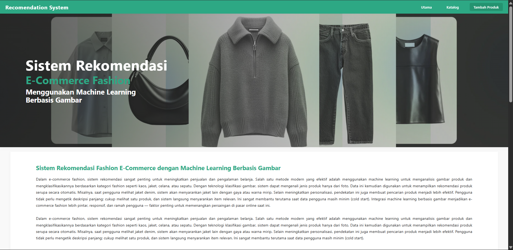
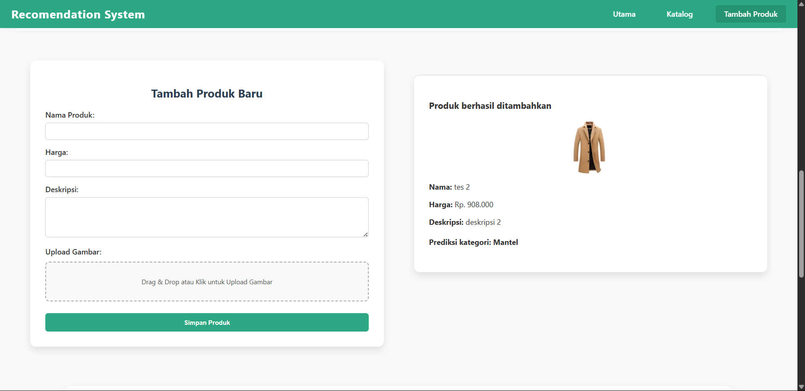
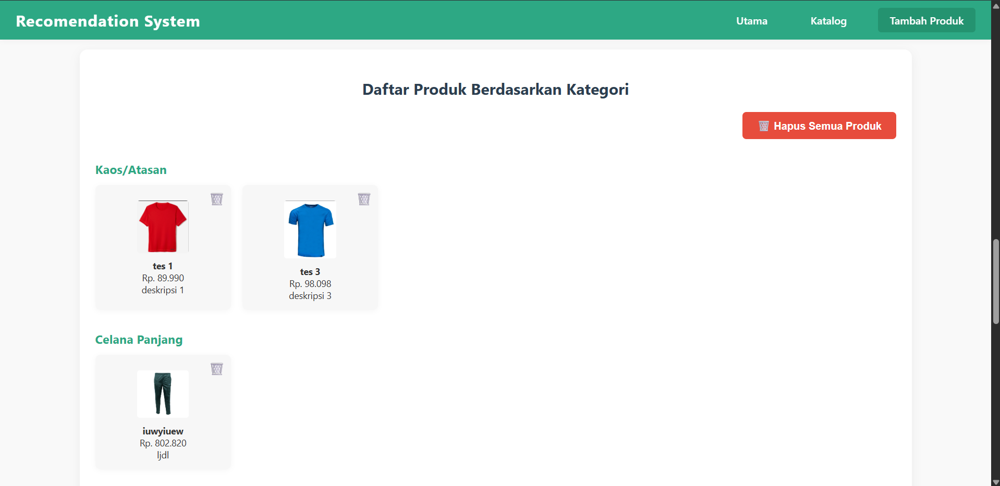
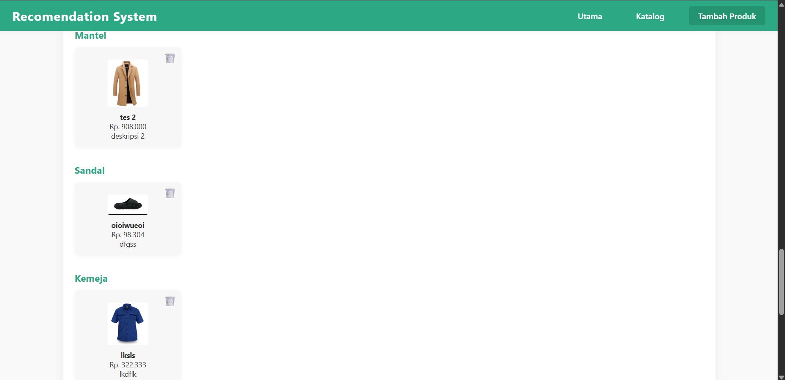
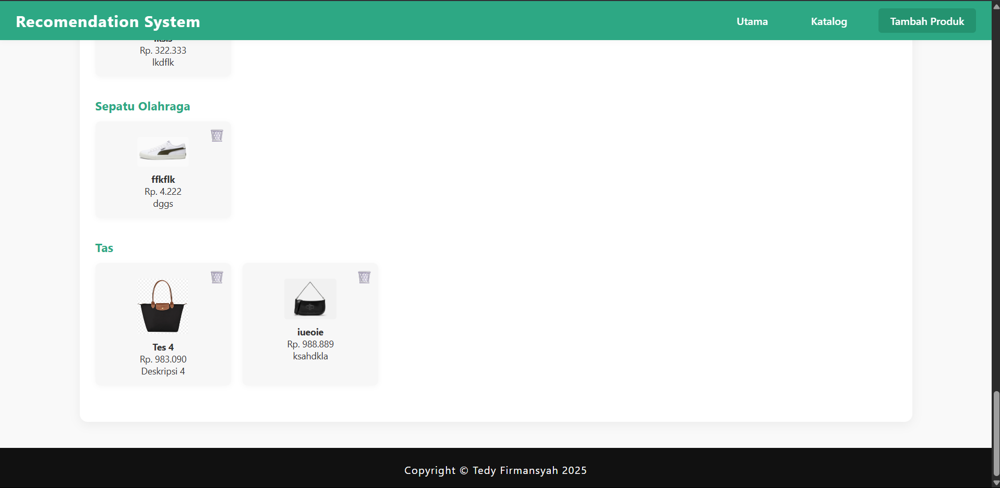

<h1 align="center">Fashion Classifier MNIST</h1>
<p align="center">Image Classification on Fashion-MNIST Using Deep Learning</p>

<p align="center">
  
  
  
  
</p>

A machine learning project to classify fashion images using the Fashion-MNIST dataset. It utilizes TensorFlow with a simple neural network to identify clothing categories from grayscale images.

## 🖼️ Deployment Preview

<p align="center">
  
  
  
  
  
</p>

## 🎯 Features

- Fully connected neural network for fashion image classification
- Performance evaluation on test data
- Simple setup and modular project structure
- Web interface with image upload capability
- Deployment-ready with Flask

## 📊 Dataset Overview

Fashion-MNIST contains:
- 60,000 training images
- 10,000 test images
- 28x28 grayscale format
- 10 clothing categories

| Label | Category     |
|-------|--------------|
| 0     | T-shirt/top  |
| 1     | Trouser      |
| 2     | Pullover     |
| 3     | Dress        |
| 4     | Coat         |
| 5     | Sandal       |
| 6     | Shirt        |
| 7     | Sneaker      |
| 8     | Bag          |
| 9     | Ankle boot   |

## 🚀 Getting Started

### Prerequisites

- Python 3.8+
- pip
- Virtual environment (recommended)

### Setup Instructions

```bash
git clone https://github.com/Tedshub/fashion-classifier-mnsit.git
cd fashion-classifier-mnsit
python -m venv venv
# Windows
venv\Scripts\activate
# macOS/Linux
source venv/bin/activate
pip install -r requirements.txt
```

### Run the App

```bash
python app.py
```

The app will launch a local server with a web interface for predictions.

## 📁 Project Structure

```
fashion-classifier-mnsit/
├── model/                  # Model training and classification scripts
├── static/
│   ├── assets/             # Static assets (images, icons, etc.)
│   └── upload/             # Folder to store uploaded images
├── templates/              # HTML templates for the web interface
├── venv/                   # Virtual environment (excluded from GitHub)
├── app.py                  # Main Flask application
└── README.md               # Project documentation
```

## 📈 Model Performance

- Accuracy: ~87-90% on test data (Fully Connected Network)
- Training duration: short and efficient for demo-level usage

## 🛠️ Tools & Libraries

- TensorFlow
- NumPy
- Flask
- Matplotlib
- scikit-learn

## 🔧 Future Improvements

- [ ] Upgrade to CNN for better accuracy
- [ ] Add prediction heatmaps and sample visualizations
- [ ] Export trained model as `.h5` or `.tflite`
- [ ] Improve web UI with live camera input
- [ ] Add logging and monitoring dashboard

## 🤝 Contributing

Contributions are welcome!  
To contribute:

```bash
git checkout -b feature/your-feature
git commit -m "Add your feature"
git push origin feature/your-feature
```

Then open a Pull Request.

## 📝 License

This project is licensed under the MIT License. See [LICENSE](LICENSE) for more details.

## 👤 Author

- GitHub: [@Tedshub](https://github.com/Tedshub)

---

<p align="center"><strong>If you find this project helpful, please give it a ⭐ on GitHub!</strong></p>

## 👤 Author

**[@Tedshub](https://github.com/Tedshub)**

- GitHub: [@Tedshub](https://github.com/Tedshub)
- Email: *Contact via GitHub*

## 🙏 Acknowledgments

- Fashion-MNIST dataset by [Zalando Research](https://github.com/zalandoresearch/fashion-mnist)
- TensorFlow team for the excellent deep learning framework
- Open source community for inspiration and resources

## 📚 References

- [Fashion-MNIST Official Repository](https://github.com/zalandoresearch/fashion-mnist)
- [TensorFlow Documentation](https://www.tensorflow.org/api_docs)
- [Keras API Reference](https://keras.io/api/)

---

**Happy learning and experimenting with deep learning in the fashion world! ✨**

*If you find this project helpful, please consider giving it a ⭐ on GitHub!*
